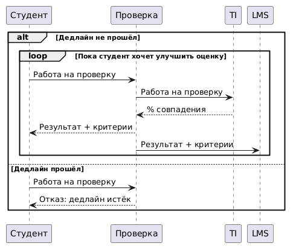
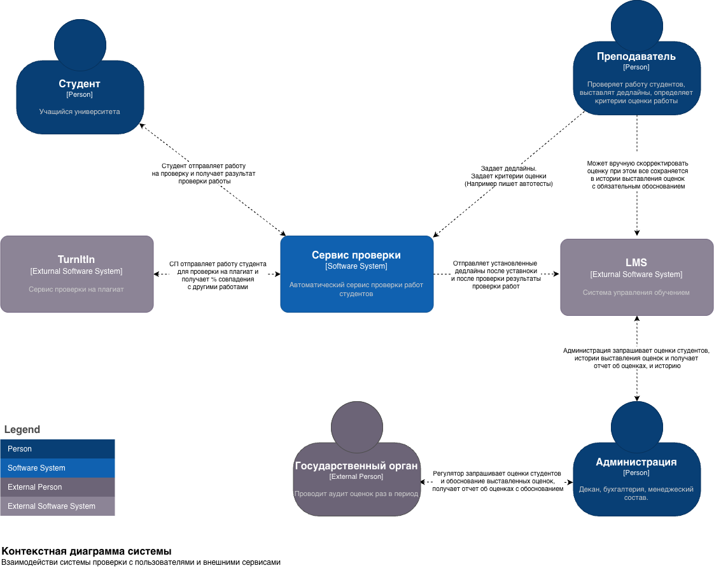

# ДЗ 1 - Представления архитектуры

## Задача

Университет значительно расширил курс по компьютерным наукам и хочет автоматизировать проверку простых заданий по программированию.

1. Пользователи: более 300 студентов в год, а также сотрудники и администрация.
2. Требования:

- учащиеся должны иметь возможность загружать свой исходный код, который будет выполняться и оцениваться
- оценки и прогоны должны быть постоянными и поддаваться аудиту
- требуется система обнаружения плагиата, включающая сравнение с другими представленными материалами, а также отправку в веб-сервис (TurnItIn).
- требуется интеграция с университетской системой управления обучением (LMS).
- профессор устанавливает дату и время сдачи, после чего заявки отклоняются.
- учащиеся могут подавать столько попыток, сколько они хотят улучшить свою оценку.
- преподаватели определяют критерии оценки, которые могут включать показатели и / или тесты.

1. Дополнительный контекст:

- LMS университета основана на мэйнфреймах, и в нее довольно сложно вносить изменения.
- оценки ежегодно проверяются государственным регулирующим органом.
- У университета на ЭТО очень мало средств, поскольку он строит запасной стадион для спортивного мяча
- Университет является рекордсменом по количеству выпускников CS с самыми высокими показателями в стране

## Бизнес-контекст

Заказчик - университет, организует курсы по прогаммированию. В процессе прохождения курсов студены выполняют домашние задания, а преподаватели их проверяют. Курс был значительно расширен, из-за чего возрос объём работ по проверке заданий и нагрузка на преподавателей.

Важные моменты:

- Университет регулируется государственным органом и ежегодно проводится аудит оценок
- Университет имеет высокие показатели среди выпускников
- Бюджет проекта существенно ограничен
- Есть система управления обучением - LMS на мейнфрейме, менять сложно

## Бизнес-цели и бизнес-драйверы

Цели

- Снизить нагрузку на преподавателей при увеличении кол-ва студентов и проверяемых работ
- Обеспечить масштабируемость процесса без пропорционального увеличения затрат
- Сохранить качество и прозрачность оценки работ

Драйверы

- Повышение кол-ва студентов и проверяемых работ
- Аудит оценок
- Высокий показатель у выпускников

## Стейкхолдеры и их потребности

Студенты

- Загрузить код и получить быструю и понятную обратную связь
- Возможность повторной попытки сдать работу столько раз сколько нужно, для улучшения оценки
- Понять что повлияло на оценку

Приеподватели

- Снизить объем ручной проверки, при этом сохранить контроль и возможность при необходимости принимать участие, например в спорных случаях
- Определить дедлайн сдачи работы на проверку
- Определить критерии выставления оценки

Администрация университета

- Прохождение регулярного аудита
- Сохранение качества обучения и высокого уровня результатов выпускников 
- Снижение стоимости проверки

Государственный регулирующий орган

- Доступ к истории выставления оценок для понимая как и почему была выставлена оценка, и достоверность выставленной оценки

## Пользовательские сценарии

### Студент отправляет работу на проверку

Бизнес-правила:

1. Работа считается «принятой», как только удовлетворяет минимальным критериям.
2. Принятие фиксируется: сохраняется версия работы на момент принятия.
3. Все последующие попытки (улучшение/ухудшение) сохраняются в истории.
4. Принятие не может быть отменено более поздней (худшей) попыткой.
5. Итоговая оценка на конец дедлайна — финальная, но факт принятия сохраняется отдельно.

## Атрибуты качества (и нефункциональные требования)

| Атрибуты качества                                         | Характеристики                                                                                                                                                                                         | Сценарии                                                                                                                                                                                                                                                                                                                                                                                                                                           |
| --------------------------------------------------------- | ------------------------------------------------------------------------------------------------------------------------------------------------------------------------------------------------------ | -------------------------------------------------------------------------------------------------------------------------------------------------------------------------------------------------------------------------------------------------------------------------------------------------------------------------------------------------------------------------------------------------------------------------------------------------- |
| Масштабируемость                                          | - Стоимость масштабирования - Деградация производительности                                                                                                                                            | - Количество студентов в год выросло с 300 до 600. Стоимость обработки одной работы выросло не более чем на 10%(1) - Нагрузка на сервис удвоилась, сервис сохраняет приемлимое время отклика, среднее время провери растет не более чем на 10%(1) 1 - гипотетические данные для предметности сценария. Реальные данные будут представлены заказчиком                                                                                               |
| Производительность                                        | - Время проверки одной работы - Объем обрабатывамеых операций в минуту - Предельная нагрузка                                                                                                           | Среднее количество студентов отправляющих работу на проверку за 6 часов до дедлайна, выросло с 10 до 20(1) в минуту. При 20 время проверки не деградирует, среднее время от момента отправки работы до получения результата проверки <= 3 сек. Выше 20 система не падает. 1 - гипотетические данные для предметности сценария. Реальные данные будут представлены заказчиком                                                                       |
| Безопасность                                              | - Последствия запуска вредоносного кода - Последствия получение доступа к данным вне системы - Ущерб от успешной атаки - Влияние атаки одним пользователем на всю систему - Изоляция исполняемого кода | - Студент загружает программу, которая пытается прочитать данные других студентов. Система изолирует выполнение кода, нет возможности получить данные другого студента - Студент пытается получить доступ к внешней среде, что бы подменить оценки. Система изолирует действия, нет возможности совершать действия вне системы                                                                                                                     |
| Отказоустойчивость                                        | - Объем потерянных данных при отказе системы - Время восстановление - Последствия отказа - Доступность системы - Возможность восстановления - Сохранение согласованного состояния                      | - Студент отправляет работу на проверку и происходит сбой системы. Сбой не блокирует возможность студента повторной отправки работы - Студент выполняет задание и в процессе выполнения происходит сбой системы. Падение не блокирует процесс выполнение задания - Студент отправляет работу на проверку и после вычисления оценки произошел сбой до ее сохранения. Данные работы не теряются, студент может повторно отправить работу на проверку |
| Аудируемость                                              | - Возможность восстановить историю изменений и выставления оценки - Невозможность неконтролируемого изменения или подмены оценки                                                                       | - Гос орган запрашивает обоснование выставления оценок. Есть возможность передать историю выставления оценок - Преподавателю необходимо выяснить почему была выставлена конкретная оценка. Есть возможность просмотреть исто                                                                                                                                                                                                                       |
| Целостность данных                                        | - Сохранность оценок - Сохранность истории                                                                                                                                                             | - Студент отправляет работу на перепроверку, при этом результат и последовательность предыдущих проверок не должны быть утеряны - При ручном изменении оценки сохраняется информация об изменении                                                                                                                                                                                                                                                  |
| Устойчивая интеграция с внешними сервисами(LMS, TurnItIn) | - Отправка данных - Получение данных - Обработка ошибок                                                                                                                                                | - Студен отправляет работу на проверку, выставляется оценка, данные отправляются во внешний сервис, происходит ошибка. Данные работы не должны быть утеряны, студент может повторно отправить работу на проверку                                                                                                                                                                                                                                   |

## Контекстная схема системы

## Критические сценарии и критические характеристики

| Характеристика                                           | Сценарий                                                                                                          | Почему критично                                                                                                       |
| -------------------------------------------------------- | ----------------------------------------------------------------------------------------------------------------- | --------------------------------------------------------------------------------------------------------------------- |
| Время проверки работы / производительность под нагрузкой | Перед дедлайном большое количество студентов одновременно отправляет работы на проверку                           | Количество попыток не ограничено, поэтому в пиковые периоды очередь может резко расти                                 |
| Сохранность оценок и истории                             | Государственный орган запрашивает обоснование выставленной оценки                                                 | Университет обязан проходить ежегодный аудит                                                                          |
| Изоляция исполняемого кода                               | Студент загружает программу, которая пытается получить доступ к данным или ресурсам за пределами среды выполнения | Система исполняет непроверенный пользовательский код, поэтому один запуск не должен влиять на данные и инфраструктуру |
| Последствия отказа                                       | Во время сохранения оценки происходит сбой                                                                        | Потеря или искажение результата нарушает требования к сохранности данных и аудиту                                     |

## 2 первых архитектурных решения запишите в виде ADR
