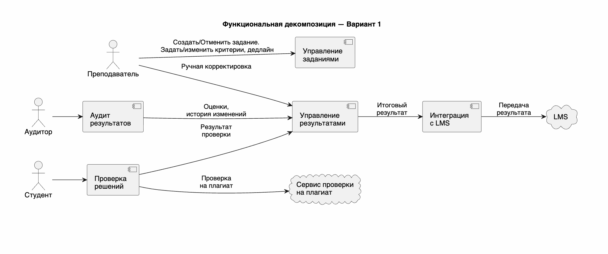
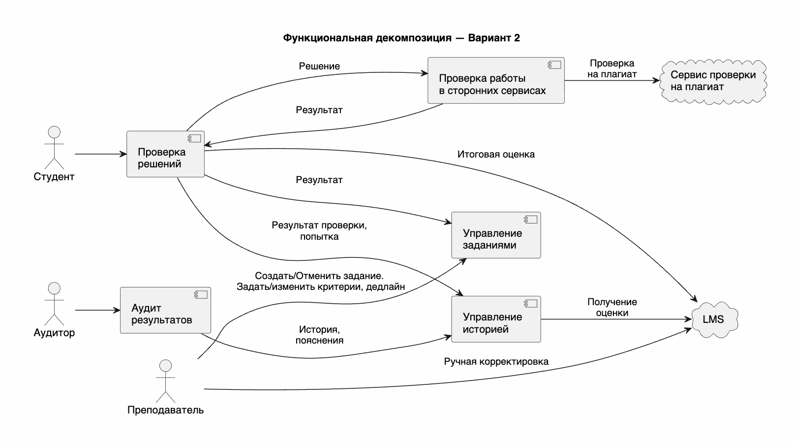

# Функциональная декомпозиция

## Вариант 1

**Управление заданиями**

- Создать задание
- Отменить задание
- Установить дедлайн
- Изменить дедлайн
- Установить критерии
- Изменить критерии

**Проверка решений**

- Фиксация попытки
- Проверка работы согласно критериям
- Проверка работы на плагиат

**Управление результатами**

- Фиксация результата проверки
- Фиксация итогового результата
- Ручная корректировка оценки

**Интеграция с LMS**

- Передача результата в LMS

**Аудит результатов**

- Получение оценок
- Получение истории выставления и корректировки оценок
- Получение пояснений к изменениям
- Формирование данных для аудита

## Вариант 2

**Управление заданиями**

- Создать задание
- Отменить задание
- Установить дедлайн
- Изменить дедлайн
- Установить критерии
- Изменить критерии

**Проверка решений**

- Фиксация попытки
- Проверка работы согласно критериям
- Фиксация результата проверки
- Фиксация итогового результата
- Передача результата в LMS

**Проверка работы в сторонних сервисах**

- Проверка работы на плагиат

**Управление историей**

- Получение оценок из LMS
- Получение истории выставления и корректировки оценок
- Получение пояснений к изменениям

**Аудит результатов**

- Формирование данных для аудита

> Требуется определить механизм получения системой информации о ручной корректировке оценки, выполненной в LMS.

### Особенности вариантов декомпозиции

**Вариант 1:**

- **работа с историей** результатов и подготовка данных для аудита объединены в компоненте `Аудит результатов`.

**Вариант 2:**

- **работа с историей** выделена в самостоятельный компонент `Управление историей`. Компонент `Аудит результатов` использует историю только для формирования данных для аудита.
- **ручная корректировка оценки выполняется средствами LMS.** Система автоматической проверки не предоставляет собственной функции корректировки оценки, но получает информацию о выполненных корректировках и сохраняет историю изменений. Механизм получения информации о корректировках требует уточнения.

## Сценарии изменения требований

1. **Замена LMS.** Университет переходит на другую LMS с другим API и способом интеграции.
   **Пример:** новая LMS использует другой формат передачи результатов и другой механизм авторизации. Необходимо адаптировать систему автоматической проверки к новой LMS.
2. **Добавление нового типа критерия проверки.** Помимо существующих тестов и метрик появляется новый тип критерия, участвующий в проверке решения и формировании результата.
   **Пример:** преподаватель получает возможность добавить критерий проверки потребления памяти программой. Новый критерий должен настраиваться для задания и учитываться при проверке решения.
3. **Ограничение количества попыток.** Вместо неограниченного количества попыток преподаватель может установить максимальное количество попыток для задания.
   **Пример:** преподаватель устанавливает для задания ограничение в 5 попыток. После пятой попытки система должна отклонять новые решения студента.
4. **Проверка решений после дедлайна без изменения оценки.** После наступления дедлайна студент может отправлять дополнительные решения для проверки по критериям, однако такие попытки не влияют на зафиксированную итоговую оценку.
   **Пример:** студент после дедлайна исправляет решение и отправляет его для проверки, чтобы увидеть результат выполнения критериев. Попытка сохраняется в истории, но итоговая оценка за задание остаётся прежней.
5. **Замена внешнего сервиса проверки на плагиат.** Используемый сервис проверки на плагиат заменяется другим внешним сервисом с другим API.
   **Пример:** новый сервис использует другой формат запроса и результата проверки. Необходимо изменить интеграцию, сохранив существующий процесс проверки решения на плагиат.

| Сценарий                                             | Что меняется                                                | Кто инициирует                             | Вероятность |
| ---------------------------------------------------- | ----------------------------------------------------------- | ------------------------------------------ | ----------- |
| Замена LMS                                           | Университет переходит на другую LMS с другим API            | Университет / администрация                | Низкая      |
| Добавление нового типа критерия проверки             | Появляется новый способ автоматической проверки             | Преподаватель                              | Высокая     |
| Ограничение количества попыток                       | Для задания задаётся максимальное число попыток             | Преподаватель                              | Средняя     |
| Проверка решений после дедлайна без изменения оценки | После дедлайна можно проверять решение без изменения оценки | Преподаватель / администрация университета | Высокая     |
| Замена внешнего сервиса проверки на плагиат          | Подключается другой внешний сервис                          | Университет / команда разработки           | Низкая      |

**Допущение:**

Оценка вероятности тербует дальнейшего подтверждения от заказчика

## Оценка стоимости изменений для каждого решения

**Замена LMS**

| Вариант       | Модулей задето | Места правки                          | Риск                                                                                                                                                                                                                    |
| ------------- | -------------- | ------------------------------------- | ----------------------------------------------------------------------------------------------------------------------------------------------------------------------------------------------------------------------- |
| **Вариант 1** | 1              | Интеграция с LMS                      | Ниже: необходимо адаптировать интеграцию под API новой LMS: формат данных, вызовы API, авторизацию и обработку ответов. Остальные компоненты работают через внутренний контракт и не должны зависеть от конкретной LMS. |
| **Вариант 2** | 2              | Проверка решений; Управление историей | Выше: `Проверка решений` напрямую передаёт итоговую оценку в LMS — необходимо изменить интеграцию. `Управление историей` получает оценки из LMS — также необходимо адаптировать взаимодействие с новой системой.        |

**Добавление нового типа критерия проверки**

| Вариант       | Модулей задето | Места правки                                     | Риск                                                                          |
| ------------- | -------------- | ------------------------------------------------ | ----------------------------------------------------------------------------- |
| **Вариант 1** | 2              | Управление заданиями; Проверка решений; возможно | Сопостовимый: новый критерий необходимо настраивать и применять при проверке. |
| **Вариант 2** | 2              | Управление заданиями; Проверка решений; возможно | Сопостовимый: новый критерий необходимо настраивать и применять при проверке. |

**Ограничение количества попыток**

| Вариант       | Модулей задето | Места правки                           | Риск                                                                                                                                                                                              |
| ------------- | -------------- | -------------------------------------- | ------------------------------------------------------------------------------------------------------------------------------------------------------------------------------------------------- |
| **Вариант 1** | 2              | Управление заданиями; Проверка решений | Сопостовимый: требует изменения настройки заданий и поверки кол-ва попыток перед проверкой решения. Есть риск рассинхронизации, если студент уже отправил задание на проверку и ввели органичение |
| **Вариант 2** | 2              | Управление заданиями; Проверка решений | Сопостовимый: границы ответственности такие же, поэтому изменение затрагивает те же компоненты и несёт аналогичный риск.                                                                          |

**Проверка решений после дедлайна без изменения оценки**

| Вариант       | Модулей задето | Места правки                                     | Риск                                                                                                                                                                                                                               |
| ------------- | -------------- | ------------------------------------------------ | ---------------------------------------------------------------------------------------------------------------------------------------------------------------------------------------------------------------------------------- |
| **Вариант 1** | 2              | Проверка решений; Управление результатами        | Выше: Требует согласованного решения `Проверка решений` и `Управление результатами` . Есть риск что результат попытки после дедлайна ошибочно повлияет на итоговый результат до дедлайна.                                          |
| **Вариант 2** | 1–2            | Проверка решений; Допущение: Управление историей | Ниже: Основная логика локализована в `Проверке решений`: попытка принимается и проверяется, но новая оценка не передаётся в LMS. `Управление историей` изменяется только при необходимости специального отображения таких попыток. |

**Замена внешнего сервиса проверки на плагиат**

| Вариант       | Модулей задето | Места правки                         | Риск                                                                                                                                                                                                                            |
| ------------- | -------------- | ------------------------------------ | ------------------------------------------------------------------------------------------------------------------------------------------------------------------------------------------------------------------------------- |
| **Вариант 1** | 1              | Проверка решений                     | Выше: необходимо адаптировать взаимодействие с API нового сервиса проверки на плагиат. Изменение происходит внутри компонента основной бизнес-логики проверки, что увеличивает область потенциального влияния и риск регрессии. |
| **Вариант 2** | 1              | Проверка работы в сторонних сервисах | Ниже: необходимо адаптировать только интеграцию с новым сервисом. При сохранении внутреннего контракта `Проверка решений` не изменяется, поэтому изменение лучше локализовано.                                                  |
