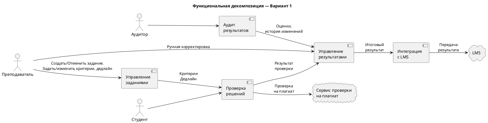

# Функциональная декомпозиция — Вариант 1

Диаграмма воспроизводит состав компонентов, связи и подписи из `variant_1.png`.

```plantuml
@startuml
title Функциональная декомпозиция — Вариант 1

left to right direction

actor "Преподаватель" as Teacher
actor "Аудитор" as Auditor
actor "Студент" as Student

component "Управление\nзаданиями" as Tasks
component "Аудит\nрезультатов" as Audit
component "Проверка\nрешений" as Check
component "Управление\nрезультатами" as Results
component "Интеграция\nс LMS" as Integration

cloud "LMS" as LMS
cloud "Сервис проверки\nна плагиат" as Plagiarism

Teacher --> Tasks : Создать/Отменить задание.\nЗадать/изменить критерии, дедлайн
Teacher --> Results : Ручная корректировка
Tasks --> Check: Критерии\nДедлайн

Auditor --> Audit
Audit --> Results : Оценки,\nистория изменений

Student --> Check
Check --> Results : Результат\nпроверки
Check --> Plagiarism : Проверка\nна плагиат

Results --> Integration : Итоговый\nрезультат
Integration --> LMS : Передача\nрезультата

@enduml
```
