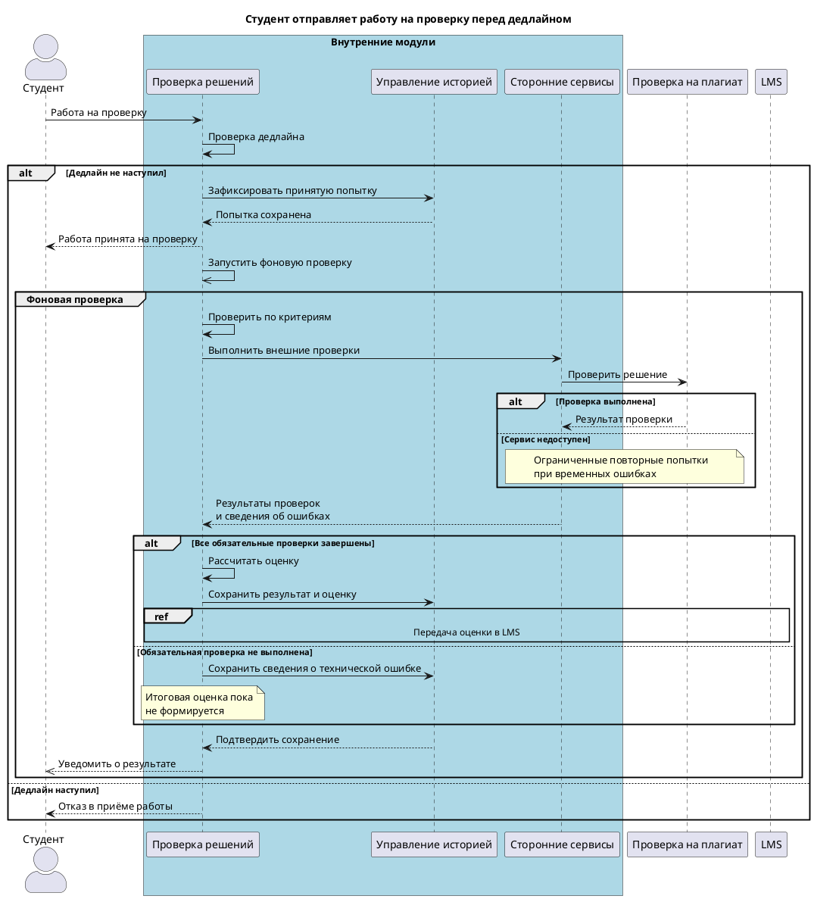
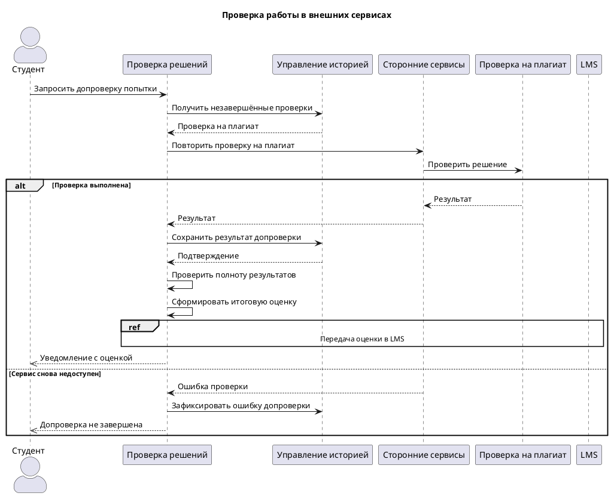
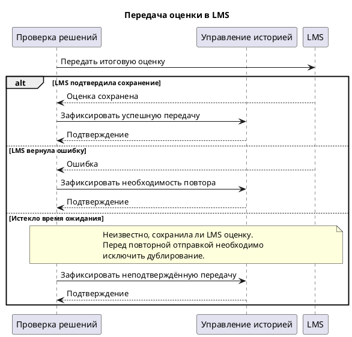

# Диаграмма сценария

```plantuml
@startuml
title Студент отправляет работу на проверку перед дедлайном
skinparam actorStyle awesome

actor "Студент" as Student

box "Внутренние модули" #LightBlue
    participant "Проверка решений" as Check
    participant "Управление историей" as History
    participant "Сторонние сервисы" as External
end box

participant "Проверка на плагиат" as Pl
participant "LMS" as LMS

Student -> Check : Работа на проверку

Check -> Check : Проверка дедлайна

alt Дедлайн не наступил
    Check -> History : Зафиксировать принятую попытку
    History --> Check : Попытка сохранена

    Check --> Student : Работа принята на проверку

    Check ->> Check : Запустить фоновую проверку

    group Фоновая проверка
        Check -> Check : Проверить по критериям
        Check -> External : Выполнить внешние проверки

        External -> Pl : Проверить решение

        alt Проверка выполнена
		    Pl --> External : Результат проверки
		else Сервис недоступен
		    note over External, Pl
		        Ограниченные повторные попытки
		        при временных ошибках
		    end note
		end

        External --> Check : Результаты проверок\nи сведения об ошибках

        alt Все обязательные проверки завершены
		    Check -> Check : Рассчитать оценку
		    Check -> History : Сохранить результат и оценку

			ref over Check, History, LMS
		        Передача оценки в LMS
		    end ref
		else Обязательная проверка не выполнена
		    Check -> History : Сохранить сведения о технической ошибке
		    note over Check
		        Итоговая оценка пока
		        не формируется
		    end note
		end

        History --> Check : Подтвердить сохранение
        Check -->> Student : Уведомить о результате
    end

else Дедлайн наступил
    Check --> Student : Отказ в приёме работы
end
@enduml
```

```plantuml
@startuml
title Проверка работы в внешних сервисах
skinparam actorStyle awesome
actor "Студент" as Student

participant "Проверка решений" as Check
participant "Управление историей" as History
participant "Сторонние сервисы" as External
participant "Проверка на плагиат" as Pl

Student -> Check : Запросить допроверку попытки

Check -> History : Получить незавершённые проверки
History --> Check : Проверка на плагиат

Check -> External : Повторить проверку на плагиат
External -> Pl : Проверить решение

alt Проверка выполнена
    Pl --> External : Результат
    External --> Check : Результат

    Check -> History : Сохранить результат допроверки
    History --> Check : Подтверждение

    Check -> Check : Проверить полноту результатов
    Check -> Check : Сформировать итоговую оценку

	ref over Check, History, LMS
        Передача оценки в LMS
    end ref

    Check -->> Student : Уведомление с оценкой

else Сервис снова недоступен
    External --> Check : Ошибка проверки
    Check -> History : Зафиксировать ошибку допроверки
    Check -->> Student : Допроверка не завершена
end
@enduml
```

```plantuml
@startuml
title Передача оценки в LMS

participant "Проверка решений" as Check
participant "Управление историей" as History
participant "LMS" as LMS

Check -> LMS : Передать итоговую оценку

alt LMS подтвердила сохранение
    LMS --> Check : Оценка сохранена
    Check -> History : Зафиксировать успешную передачу
    History --> Check : Подтверждение

else LMS вернула ошибку
    LMS --> Check : Ошибка
    Check -> History : Зафиксировать необходимость повтора
    History --> Check : Подтверждение

else Истекло время ожидания
    note over Check, LMS
        Неизвестно, сохранила ли LMS оценку.
        Перед повторной отправкой необходимо
        исключить дублирование.
    end note

    Check -> History : Зафиксировать неподтверждённую передачу
    History --> Check : Подтверждение
end
@enduml
```
