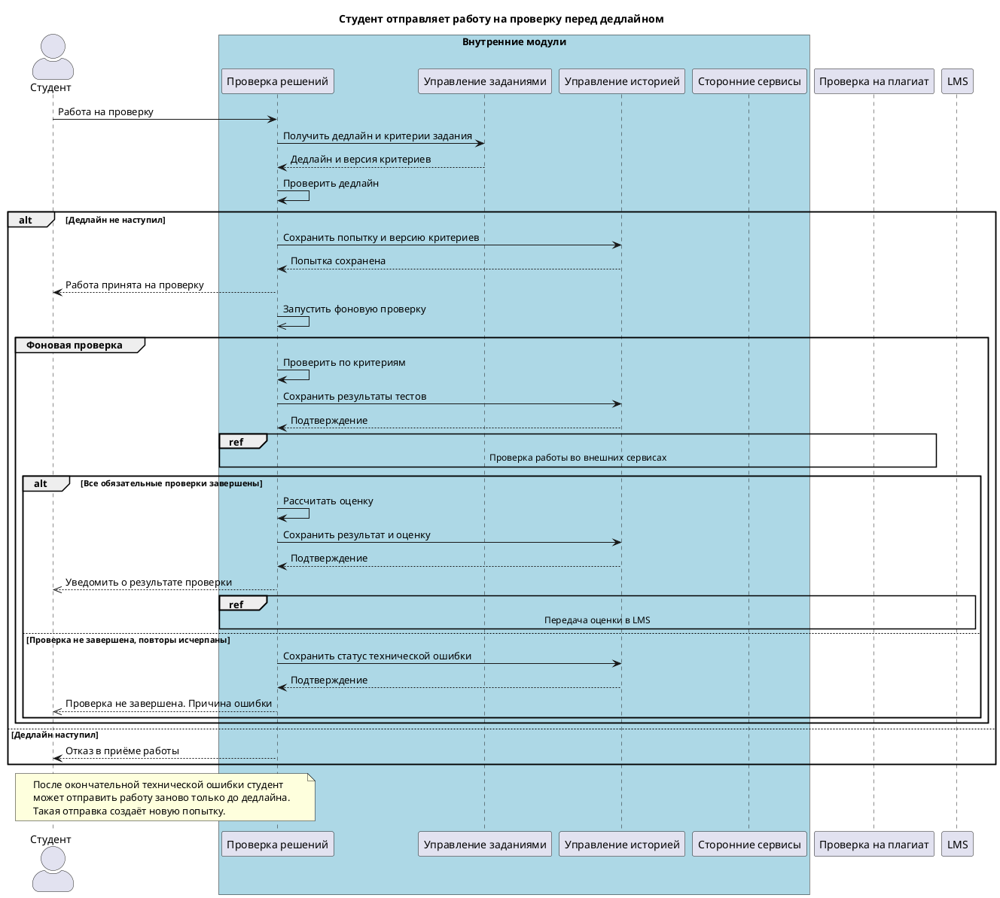
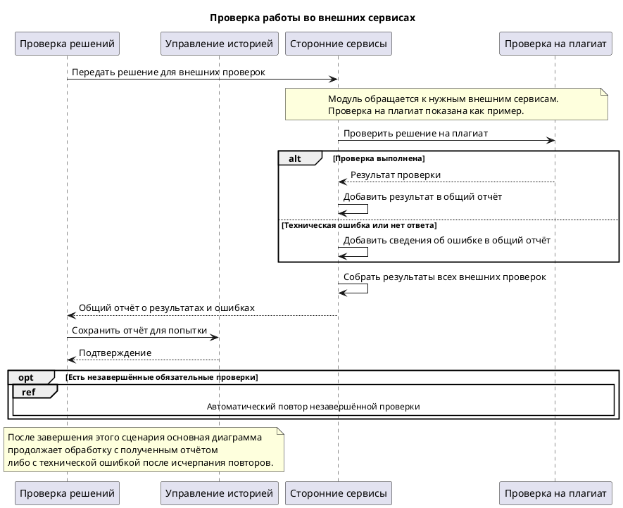
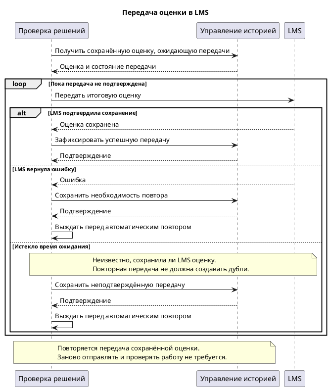
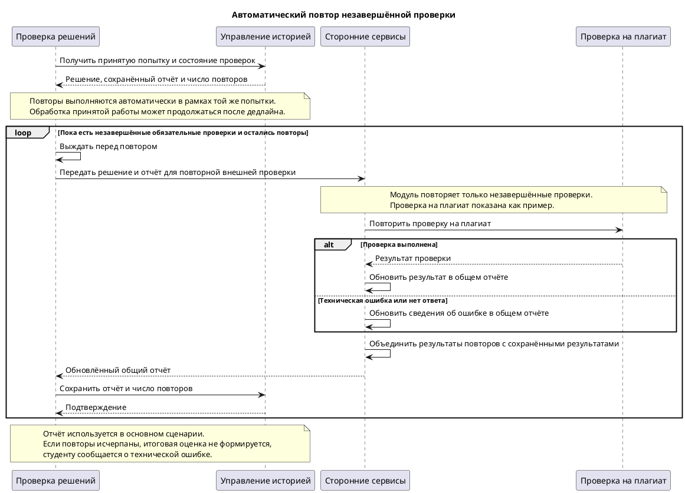

# Диаграммы сценария

```plantuml
@startuml
title Студент отправляет работу на проверку перед дедлайном
skinparam actorStyle awesome

actor "Студент" as Student

box "Внутренние модули" #LightBlue
    participant "Проверка решений" as Check
    participant "Управление заданиями" as Tasks
    participant "Управление историей" as History
    participant "Сторонние сервисы" as External
end box

participant "Проверка на плагиат" as Pl
participant "LMS" as LMS

Student -> Check : Работа на проверку
Check -> Tasks : Получить дедлайн и критерии задания
Tasks --> Check : Дедлайн и версия критериев
Check -> Check : Проверить дедлайн

alt Дедлайн не наступил
    Check -> History : Сохранить попытку и версию критериев
    History --> Check : Попытка сохранена
    Check --> Student : Работа принята на проверку

    Check ->> Check : Запустить фоновую проверку

    group Фоновая проверка
        Check -> Check : Проверить по критериям
        Check -> History : Сохранить результаты тестов
        History --> Check : Подтверждение

        ref over Check, History, External, Pl
            Проверка работы во внешних сервисах
        end ref

        alt Все обязательные проверки завершены
            Check -> Check : Рассчитать оценку
            Check -> History : Сохранить результат и оценку
            History --> Check : Подтверждение
            Check -->> Student : Уведомить о результате проверки

            ref over Check, History, LMS
                Передача оценки в LMS
            end ref
        else Проверка не завершена, повторы исчерпаны
            Check -> History : Сохранить статус технической ошибки
            History --> Check : Подтверждение
            Check -->> Student : Проверка не завершена. Причина ошибки
        end
    end

else Дедлайн наступил
    Check --> Student : Отказ в приёме работы
end

note over Student, Check
    После окончательной технической ошибки студент
    может отправить работу заново только до дедлайна.
    Такая отправка создаёт новую попытку.
end note
@enduml
```

```plantuml
@startuml
title Проверка работы во внешних сервисах

participant "Проверка решений" as Check
participant "Управление историей" as History
participant "Сторонние сервисы" as External
participant "Проверка на плагиат" as Pl

Check -> External : Передать решение для внешних проверок

note over External, Pl
    Модуль обращается к нужным внешним сервисам.
    Проверка на плагиат показана как пример.
end note

External -> Pl : Проверить решение на плагиат

alt Проверка выполнена
    Pl --> External : Результат проверки
    External -> External : Добавить результат в общий отчёт
else Техническая ошибка или нет ответа
    External -> External : Добавить сведения об ошибке в общий отчёт
end

External -> External : Собрать результаты всех внешних проверок
External --> Check : Общий отчёт о результатах и ошибках
Check -> History : Сохранить отчёт для попытки
History --> Check : Подтверждение

opt Есть незавершённые обязательные проверки
    ref over Check, History, External, Pl
        Автоматический повтор незавершённой проверки
    end ref
end

note over Check, History
    После завершения этого сценария основная диаграмма
    продолжает обработку с полученным отчётом
    либо с технической ошибкой после исчерпания повторов.
end note
@enduml
```

```plantuml
@startuml
title Передача оценки в LMS

participant "Проверка решений" as Check
participant "Управление историей" as History
participant "LMS" as LMS

Check -> History : Получить сохранённую оценку, ожидающую передачи
History --> Check : Оценка и состояние передачи

loop Пока передача не подтверждена
    Check -> LMS : Передать итоговую оценку

    alt LMS подтвердила сохранение
        LMS --> Check : Оценка сохранена
        Check -> History : Зафиксировать успешную передачу
        History --> Check : Подтверждение
    else LMS вернула ошибку
        LMS --> Check : Ошибка
        Check -> History : Сохранить необходимость повтора
        History --> Check : Подтверждение
        Check -> Check : Выждать перед автоматическим повтором
    else Истекло время ожидания
        note over Check, LMS
            Неизвестно, сохранила ли LMS оценку.
            Повторная передача не должна создавать дубли.
        end note

        Check -> History : Сохранить неподтверждённую передачу
        History --> Check : Подтверждение
        Check -> Check : Выждать перед автоматическим повтором
    end
end

note over Check, History
    Повторяется передача сохранённой оценки.
    Заново отправлять и проверять работу не требуется.
end note
@enduml
```

```plantuml
@startuml
title Автоматический повтор незавершённой проверки

participant "Проверка решений" as Check
participant "Управление историей" as History
participant "Сторонние сервисы" as External
participant "Проверка на плагиат" as Pl

Check -> History : Получить принятую попытку и состояние проверок
History --> Check : Решение, сохранённый отчёт и число повторов

note over Check, History
    Повторы выполняются автоматически в рамках той же попытки.
    Обработка принятой работы может продолжаться после дедлайна.
end note

loop Пока есть незавершённые обязательные проверки и остались повторы
    Check -> Check : Выждать перед повтором
    Check -> External : Передать решение и отчёт для повторной внешней проверки

    note over External, Pl
        Модуль повторяет только незавершённые проверки.
        Проверка на плагиат показана как пример.
    end note

    External -> Pl : Повторить проверку на плагиат

    alt Проверка выполнена
        Pl --> External : Результат проверки
        External -> External : Обновить результат в общем отчёте
    else Техническая ошибка или нет ответа
        External -> External : Обновить сведения об ошибке в общем отчёте
    end

    External -> External : Объединить результаты повторов с сохранёнными результатами
    External --> Check : Обновлённый общий отчёт
    Check -> History : Сохранить отчёт и число повторов
    History --> Check : Подтверждение
end

note over Check, History
    Отчёт используется в основном сценарии.
    Если повторы исчерпаны, итоговая оценка не формируется,
    студенту сообщается о технической ошибке.
end note
@enduml
```
