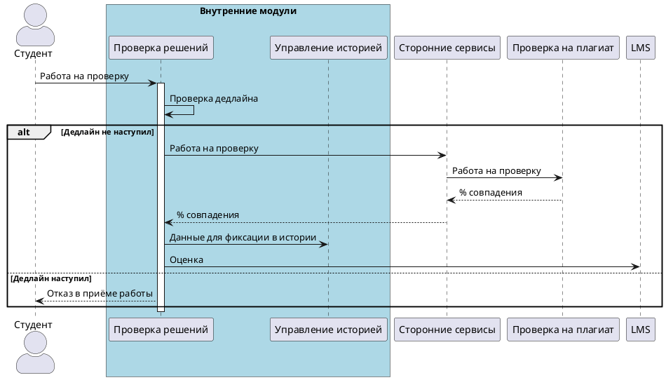

# Студент отправляет работу на проверку перед дедлайном

```plantuml
@startuml
skinparam actorStyle awesome

actor Студент as Student

box "Внутренние модули" #LightBlue
    participant "Проверка решений" as Check
    participant "Управление историей" as History
end box

participant "Сторонние сервисы" as External
participant "Проверка на плагиат" as Pl
participant "LMS" as LMS

Student -> Check : Работа на проверку
activate Check

Check -> Check : Проверка дедлайна

alt Дедлайн не наступил
    Check -> External : Работа на проверку
    External -> Pl : Работа на проверку
    Pl --> External : % совпадения
    External --> Check : % совпадения

    Check -> History : Данные для фиксации в истории
    Check -> LMS : Оценка
else Дедлайн наступил
    Check --> Student : Отказ в приёме работы
end

deactivate Check
@enduml
```
